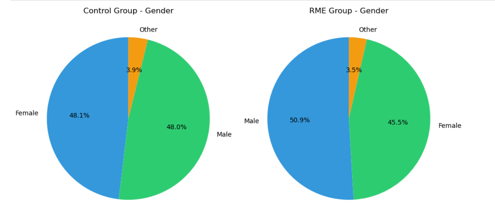

# Emergency Department A/B Testing: Rapid Medical Evaluation System

## Project Overview
This project evaluates the effectiveness of a Rapid Medical Evaluation (RME) system in reducing Emergency Department (ED) length of stay through a randomized A/B test analysis
## Key Finding
#### The RME system has led to a significant reduction in Emergency Department (ED) length of stay decreasing it by 90 minutes (22.4%) with high statistical significance (p<0.001)
#### 
## Business Problem
Emergency Department crowding is a critical healthcare challenge that leads to:

- Delayed patient care and increased wait times
- Lower patient satisfaction scores
- Reduced hospital capacity
- Increased healthcare costs

#### The Rapid Medical Evaluation system aims to address this by having physicians evaluate patients immediately after triage, eliminating the waiting room bottleneck.
## Dataset

Total Patients: 3,975 eligible patients
Study Period: January - March 2023 (3 months)
Inclusion Criteria: Triage acuity 3-5, discharged patients
#### Groups:

Control (n=1,945): Standard ED workflow
RME (n=2,030): Rapid Medical Evaluation pathway

#### Key Variables:

- Primary outcome: Length of stay (minutes)
- Secondary outcomes: Time-to-provider, patient satisfaction scores
- Demographics: Age, gender, insurance type
- Clinical: Triage acuity, chief complaint, disposition

## Steps Done:
1. Data Preparation & Quality Checks
- Data cleaning and validation
- Outlier detection using Z-Score
- Missing data assessment (150 satisfaction scores)

2. Baseline Balance Assessment
Verified randomization success by comparing groups on:
- Age, Gender , triage Acuity and Insurance type

**Result:** Groups were well-balanced across all baseline characteristics, confirming valid randomization.

3. Statistical Analysis
. Primary Analysis:

- confidence intervals (10,000 iterations) for difference in means
- Independent samples t-test for hypothesis testing

. Secondary Analyses:

- Time-to-provider comparison
- Patient satisfaction score analysis

## Key Results
Primary Outcome: Length of Stay

- 95% Confidence Interval: [77.2, 103.2] minutes
- p-value: <0.001
- Cohen's d: 0.43 (medium-to-large effect)
- Percent Reduction: 22.4%

Secondary Outcomes
Time-to-Provider:

- Control: ~55 minutes average wait
- RME: ~18 minutes average wait
- Reduction: ~37 minutes (67%)

Patient Satisfaction:

- Statistically significant improvement in RME group
## Visualizations
Baseline Balance Check

## Technical Stack
. Languages & Libraries:

- Python 3.8+
- pandas, numpy (data manipulation)
- scipy.stats (statistical testing)
- matplotlib, seaborn (visualization)
- Jupyter Notebook (analysis environment)
